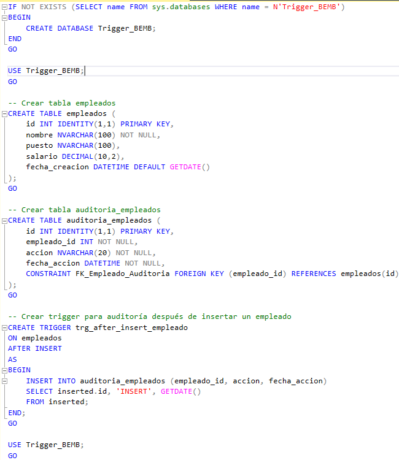
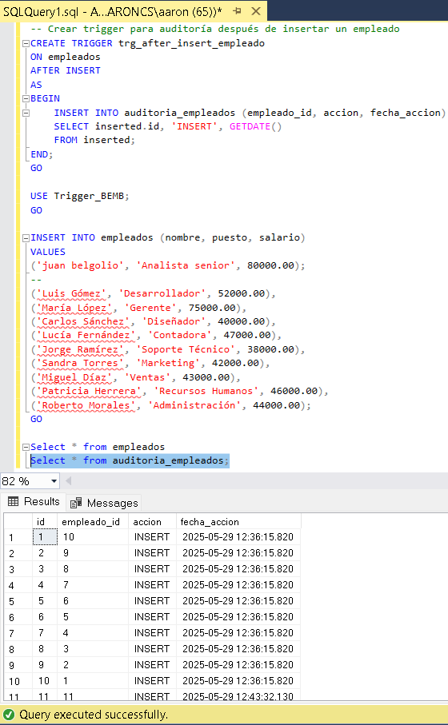

<h1 style="font-family:'Times New Roman'; display: flex; align-items: center; gap: 8px;">
  
   Concepto Trigger en una BD
</h1>

📌 <strong>¿Qué es un Trigger en Base de Datos?</strong> 
Un <strong>Trigger</strong> (disparador) es un objeto de la base de datos que ejecuta automáticamente un conjunto de instrucciones cuando ocurre un evento específico sobre una tabla o vista. Este evento puede ser una operación de:

<ul style="font-family:'Times New Roman'; font-size:16px;">
  <li><strong>INSERT</strong> (inserción de datos)</li>
  <li><strong>UPDATE</strong> (actualización de datos)</li>
  <li><strong>DELETE</strong> (eliminación de datos)</li>
</ul>

<strong>¿Para qué sirve un Trigger?</strong> 
Un Trigger sirve para ejecutar automáticamente una acción en la base de datos cuando ocurre un evento específico (<code>INSERT</code>, <code>UPDATE</code> o <code>DELETE</code>) sobre una tabla o vista. Su objetivo principal es automatizar procesos, mantener la integridad de los datos y aplicar reglas de negocio sin intervención directa del usuario.

📌 <strong>Usos comunes de un Trigger:</strong>

<ul style="font-family:'Times New Roman'; font-size:16px;">
  <li><strong>Auditoría de datos:</strong> Registrar automáticamente cambios realizados en una tabla (por ejemplo, cambios de salario, estado de pedidos, etc.).</li>
  <li><strong>Validaciones automáticas:</strong> Verificar condiciones antes de permitir operaciones, como impedir eliminar un cliente con deudas pendientes.</li>
  <li><strong>Actualizaciones encadenadas:</strong> Modificar datos en otras tablas relacionadas (por ejemplo, actualizar el stock al registrar una venta).</li>
  <li><strong>Seguridad:</strong> Prevenir acciones no autorizadas o registrar accesos indebidos.</li>
  <li><strong>Automatización de procesos:</strong> Enviar alertas, generar logs, o actualizar estados sin necesidad de que el sistema lo gestione manualmente.</li>
</ul>

<strong>3- ¿Cuándo se puede usar un Trigger?</strong> 
Un Trigger se puede usar siempre que se necesite automatizar tareas dentro de la base de datos que dependan de cambios en los datos, tales como auditorías, validaciones, mantenimiento de integridad referencial, o ejecución de reglas de negocio complejas que deben activarse con cada operación de inserción, actualización o eliminación.

<h2 style="font-family:'Times New Roman';">4- Estructura de un Trigger</h2>

Un Trigger se compone de varias partes clave que definen cuándo y cómo se ejecuta la acción automática en la base de datos. La estructura general incluye:

<ul style="font-family:'Times New Roman'; font-size:16px;">
  <li><strong>Nombre del Trigger:</strong> Identificador único del trigger dentro de la base de datos.</li>
  <li><strong>Evento que lo activa:</strong> Puede ser <code>INSERT</code>, <code>UPDATE</code> o <code>DELETE</code>.</li>
  <li><strong>Momento de ejecución:</strong> Indica si se ejecuta <em>antes</em> (<code>BEFORE</code>) o <em>después</em> (<code>AFTER</code>) del evento.</li>
  <li><strong>Tabla o vista asociada:</strong> La tabla o vista sobre la que actúa el trigger.</li>
  <li><strong>Acción o bloque de código:</strong> El conjunto de instrucciones SQL que se ejecutan cuando se activa el trigger.</li>
</ul>

<h2 style="font-family:'Times New Roman';">5- Tipos de Trigger</h2>

Existen varios tipos de triggers que se clasifican según el momento en que se ejecutan y el tipo de evento que los activa:

<ul style="font-family:'Times New Roman'; font-size:16px;">
  <li><strong>BEFORE Trigger:</strong> Se ejecuta antes de que se realice la operación de <code>INSERT</code>, <code>UPDATE</code> o <code>DELETE</code>. Se usa para validar o modificar datos antes de guardarlos.</li>
  <li><strong>AFTER Trigger:</strong> Se ejecuta después de que la operación ha sido completada. Es útil para tareas como auditorías o actualizaciones relacionadas.</li>
  <li><strong>INSTEAD OF Trigger:</strong> Se utiliza principalmente en vistas para reemplazar la operación de <code>INSERT</code>, <code>UPDATE</code> o <code>DELETE</code> con lógica personalizada.</li>
</ul>

<h2 style="font-family:'Times New Roman';">6- ¿Cuándo ejecuta su acción un Trigger?</h2>

Un trigger ejecuta su acción automáticamente en respuesta a un evento definido en su creación, que puede ser una operación de <code>INSERT</code>, <code>UPDATE</code> o <code>DELETE</code> sobre la tabla o vista asociada. La ejecución ocurre en el momento especificado: 

<ul style="font-family:'Times New Roman'; font-size:16px;">
  <li><strong>Antes</strong> del evento, en triggers <code>BEFORE</code>.</li>
  <li><strong>Después</strong> del evento, en triggers <code>AFTER</code>.</li>
  <li>En lugar de la operación original, en triggers <code>INSTEAD OF</code> (usualmente en vistas).</li>
</ul>

Esta ejecución es automática y no requiere intervención manual, garantizando así la consistencia y automatización de procesos dentro de la base de datos.

<h2 style="font-family:'Times New Roman';">7- Ejemplo de un Trigger</h2>

A continuación se muestra un ejemplo de un trigger en SQL que se activa <strong>después</strong> de insertar un nuevo registro en una tabla llamada <code>empleados</code>. Este trigger registra automáticamente la inserción en una tabla de auditoría llamada <code>auditoria_empleados</code> para llevar control de los cambios.

<pre style="font-family:'Courier New', monospace; background-color:#f0f0f0; padding:10px; border-radius:5px;">
CREATE TRIGGER trg_after_insert_empleado
AFTER INSERT ON empleados
FOR EACH ROW
BEGIN
    INSERT INTO auditoria_empleados (empleado_id, accion, fecha_accion)
    VALUES (NEW.id, 'INSERT', NOW());
END;
</pre>

En este ejemplo:

<ul style="font-family:'Times New Roman'; font-size:16px; text-align:justify;">
  <li><code>trg_after_insert_empleado</code> es el nombre del trigger.</li>
  <li><code>AFTER INSERT ON empleados</code> indica que el trigger se ejecuta después de insertar un registro en la tabla <code>empleados</code>.</li>
  <li><code>FOR EACH ROW</code> significa que se ejecuta para cada fila insertada.</li>
  <li>El bloque <code>BEGIN ... END</code> contiene la instrucción que inserta un registro en la tabla de auditoría, capturando el ID del empleado, el tipo de acción y la fecha/hora actual.</li>
</ul>

<h2 style="font-family:'Times New Roman';">8- Trigger Marketing</h2>

En el contexto del marketing, un <strong>trigger marketing</strong> (o marketing de activación por disparadores) es una estrategia que consiste en enviar mensajes o ejecutar acciones automatizadas cuando un usuario realiza una acción específica o cuando ocurre un evento determinado. Estos disparadores permiten personalizar la comunicación con el cliente y mejorar su experiencia.

📌 <strong>Ejemplos comunes de triggers en marketing:<

<pre style="font-family:'Courier New', monospace; background-color:#f0f0f0; padding:10px; border-radius:5px;">
CREATE TRIGGER trg_empleado_update
AFTER UPDATE ON empleados
FOR EACH ROW
BEGIN
    INSERT INTO auditoria_empleados (
        empleado_id,
        campo_modificado,
        valor_anterior,
        valor_nuevo,
        usuario_modifico,
        fecha_modificacion
    )
    VALUES (
        NEW.id,
        'salario',
        OLD.salario,
        NEW.salario,
        CURRENT_USER(),
        NOW()
    );
END;
</pre>

<h2 style="font-family:'Times New Roman';">9- ¿Cómo hacer un Trigger?</h2>

Crear un Trigger (disparador) implica definir una acción automática que la base de datos ejecutará en respuesta a ciertos eventos, como inserciones, actualizaciones o eliminaciones en una tabla. El proceso varía ligeramente según el sistema de gestión de base de datos (MySQL, PostgreSQL, SQL Server, etc.), pero en general sigue una estructura común.

📌 <strong>Pasos básicos para crear un Trigger:</strong>

<ul style="font-family:'Times New Roman'; font-size:16px; text-align:justify;">
  <li>1️⃣ Elegir la tabla sobre la que actuará el trigger.</li>
  <li>2️⃣ Definir el evento que lo activará: <code>INSERT</code>, <code>UPDATE</code> o <code>DELETE</code>.</li>
  <li>3️⃣ Especificar el momento: <code>BEFORE</code> (antes del evento) o <code>AFTER</code> (después del evento).</li>
  <li>4️⃣ Escribir el bloque de instrucciones que debe ejecutarse automáticamente.</li>
</ul>

A continuación, un ejemplo básico de cómo crear un Trigger en MySQL que se activa después de insertar un registro en una tabla de empleados:

<pre style="font-family:'Courier New', monospace; background-color:#f0f0f0; padding:10px; border-radius:5px;">
CREATE TRIGGER trg_after_insert_empleado
AFTER INSERT ON empleados
FOR EACH ROW
BEGIN
    INSERT INTO auditoria_empleados (empleado_id, accion, fecha_accion)
    VALUES (NEW.id, 'INSERT', NOW());
END;
</pre>

Este trigger se ejecuta automáticamente después de cada inserción en la tabla <code>empleados</code>, y registra el evento en la tabla <code>auditoria_empleados</code>.

<h2 style="font-family:'Times New Roman';">10- Características de un Trigger</h2>

  <ul style="list-style-type: square; padding-left: 20px;">
    <li><strong>Automático:</strong> Se ejecuta sin intervención del usuario cuando ocurre un evento específico (INSERT, UPDATE, DELETE).</li>
    <li><strong>Dependiente de eventos:</strong> Actúa sobre una tabla o vista cuando se produce un cambio definido.</li>
    <li><strong>Puede ser BEFORE o AFTER:</strong> Puede ejecutarse antes o después del evento que lo activa.</li>
    <li><strong>Asociado a una tabla:</strong> Cada trigger está vinculado directamente a una tabla o vista específica.</li>
    <li><strong>No se ejecuta manualmente:</strong> No puede ser llamado como una función o procedimiento almacenado.</li>
    <li><strong>Mantiene integridad y control:</strong> Sirve para validar reglas de negocio, auditar datos y automatizar tareas.</li>
    <li><strong>Puede afectar múltiples tablas:</strong> Aunque está ligado a una tabla, puede ejecutar acciones sobre otras tablas.</li>
  </ul>

<h2 style="font-family:'Times New Roman';">11-Desventajas de un Trigger</h2>

  <ul style="list-style-type: square; padding-left: 20px; color:rgb(0, 0, 0);">
    <li><strong>Complejidad oculta:</strong> Las acciones automáticas pueden dificultar el seguimiento y depuración del flujo de datos.</li>
    <li><strong>Impacto en el rendimiento:</strong> Triggers mal diseñados pueden ralentizar las operaciones de la base de datos.</li>
    <li><strong>Dificultad para mantener:</strong> El código de los triggers puede volverse complejo y difícil de actualizar o entender.</li>
    <li><strong>Dependencia del motor BD:</strong> La sintaxis y comportamiento pueden variar según el sistema gestor de base de datos, afectando portabilidad.</li>
    <li><strong>Puede generar efectos secundarios no deseados:</strong> Si no se controla adecuadamente, un trigger puede disparar otros triggers o causar ciclos infinitos.</li>
    <li><strong>Limitado control de errores:</strong> Manejar errores dentro de triggers puede ser complicado y no siempre se logran revertir transacciones fácilmente.</li>
  </ul>

<h2 style="font-family:'Times New Roman';">12-Sustituto de Trigger en otras bases de datos</h2>

<pre style="font-family:'Courier New', monospace; background-color:#f0f0f0; padding:10px; border-radius:5px;">
-- Procedimiento almacenado que simula la acción del trigger
DELIMITER $$

CREATE PROCEDURE proc_auditar_empleados()
BEGIN
    INSERT INTO auditoria_empleados (empleado_id, accion, fecha_accion)
    SELECT id, 'INSERT', NOW()
    FROM empleados
    WHERE fecha_creacion >= NOW() - INTERVAL 1 MINUTE;
END $$

DELIMITER ;

-- Evento programado que ejecuta el procedimiento cada minuto
CREATE EVENT evento_auditar_empleados
ON SCHEDULE EVERY 1 MINUTE
DO
CALL proc_auditar_empleados();
</pre>

<h2>Comprobación</h2>

<h1>Explicación del Código SQL para la Base de Datos Trigger_BEMB</h1>

<h2>1. Creación de la base de datos</h2>

<pre style="font-family:'Courier New', monospace; background-color:#f0f0f0; padding:10px; border-radius:5px;">
IF NOT EXISTS (SELECT name FROM sys.databases WHERE name = N'Trigger_BEMB')
BEGIN
    CREATE DATABASE Trigger_BEMB;
END
GO
</pre>

<h2>3. Creación de la tabla <code>empleados</code></h2>

<pre style="font-family:'Courier New', monospace; background-color:#f0f0f0; padding:10px; border-radius:5px;">
CREATE TABLE empleados (
    id INT IDENTITY(1,1) PRIMARY KEY,
    nombre NVARCHAR(100) NOT NULL,
    puesto NVARCHAR(100),
    salario DECIMAL(10,2),
    fecha_creacion DATETIME DEFAULT GETDATE()
);
GO
</pre>

Tabla que almacena datos de empleados con un ID autoincremental, nombre, puesto, salario y fecha de creación.

<h2>4. Creación de la tabla <code>auditoria_empleados</code></h2>

<pre style="font-family:'Courier New', monospace; background-color:#f0f0f0; padding:10px; border-radius:5px;">
CREATE TABLE auditoria_empleados (
    id INT IDENTITY(1,1) PRIMARY KEY,
    empleado_id INT NOT NULL,
    accion NVARCHAR(20) NOT NULL,
    fecha_accion DATETIME NOT NULL,
    CONSTRAINT FK_Empleado_Auditoria FOREIGN KEY (empleado_id) REFERENCES empleados(id)
);
GO
</pre>

Tabla que almacena los registros de auditoría de acciones realizadas sobre empleados, vinculando cada registro con un empleado específico mediante una clave foránea.

<h2>5. Creación del trigger <code>trg_after_insert_empleado</code></h2>

<pre style="font-family:'Courier New', monospace; background-color:#f0f0f0; padding:10px; border-radius:5px;">
CREATE TRIGGER trg_after_insert_empleado
ON empleados
AFTER INSERT
AS
BEGIN
    INSERT INTO auditoria_empleados (empleado_id, accion, fecha_accion)
    SELECT inserted.id, 'INSERT', GETDATE()
    FROM inserted;
END;
GO
</pre>

Trigger que se ejecuta automáticamente después de insertar un empleado, registrando la acción en la tabla de auditoría.

<h2>6. Inserción de datos de ejemplo</h2>

<pre style="font-family:'Courier New', monospace; background-color:#f0f0f0; padding:10px; border-radius:5px;">
INSERT INTO empleados (nombre, puesto, salario)
VALUES
('Ana Pérez', 'Analista', 45000.00),
('Luis Gómez', 'Desarrollador', 52000.00),
('María López', 'Gerente', 75000.00),
('Carlos Sánchez', 'Diseñador', 40000.00),
('Lucía Fernández', 'Contadora', 47000.00),
('Jorge Ramírez', 'Soporte Técnico', 38000.00),
('Sandra Torres', 'Marketing', 42000.00),
('Miguel Díaz', 'Ventas', 43000.00),
('Patricia Herrera', 'Recursos Humanos', 46000.00),
('Roberto Morales', 'Administración', 44000.00);
GO
</pre>

Inserta 10 empleados de ejemplo. Cada inserción activa el trigger automáticamente, generando registros en la tabla <code>auditoria_empleados</code>.

<h2>Ejemplo</h2>

